# Projeto Final - Infraestrutura e Serviços de Redes (Grupo-1)
Projeto final do Grupo 1 da disciplina de Infraestrutura e Serviços de Redes 

```
Instituto Federal de Alagoas - Campus Arapiraca
Professor: Alaelson Jatobá
Turma: 913
Aluno: Daniel Berg Silva Souza | Julio Cesár dos Santos Oliveira | Kelvin Holanda Leão Otilio | Ricardo Alexandre da Silva
```

### **1) Instalação e configuração do GW**

#### 1.1) Habilitando o firewall

``` 
$ sudo ufw allow ssh
```

#### 1.2) Dando permissão para que o protocolo SSH funcione através do firewall.
``` 
$ sudo ufw allow ssh
```


#### 1.3) Verificação do status do firewall
``` 
$ sudo ufw status
```


#### 1.4) Habilitando a tranferência de pacotes de WAN para LAN
Para habilitar essa funcionalidade de comunicação entre interface externa e interna do
gateway, feita com as interfaces ens160 e ens192, precisa-se configurar o arquivo ```/etc/ufw/sysctl.conf``` 
da seguinte forma: 
```
$ sudo nano /etc/ufw/sysctl.conf
net/ipv4/ip_forwarding=1 #basta descomentar esta linha do arquivo em questão
$ cat /etc/ufw/sysctl.conf
```


#### 1.5) Verificando o nome das interfaces que respondem pela configuração do arquivo acima
```
$ ifconfig
```

 ```
 Interface WAN: ens160
 Interface LAN: ens192
 Interface LoopBack: lo
```

#### 1.6) Configurando os IPs, DHCPs e Gateyas das interfaces WAN e LAN
```
$ sudo nano /etc/netplan/00-installer-config.yaml
$ sudo netplan apply
```


Após editar e aplicar as configurações, pode-se:
```
Para visualizar o arquivo: $ cat /etc/netplan/00-installer-config.yaml
```


```
Para visualizar se as configurações foram aplicadas: $ ifconfig
```


#### 1.7) Agora, cria-se o arquivo ```rc.local``` no diretório /etc.
Este arquivo receberá um script responsável pelo redirecionamento de portas entre as interfaces, para
o recibimento de pacotes.
```
$ sudo nano /etc/rc.local
```
Em seguida, inseri-se o seguinte script: 
```
#!/bin/bash

# /etc/rc.local

# Default policy to drop all incoming packets.
# Politica padrão para bloquear (drop) todos os pacotes de entrada
iptables -P INPUT DROP
iptables -P FORWARD DROP

# Accept incoming packets from localhost and the LAN interface.
# Aceita pacotes de entrada a partir das interfaces localhost e the LAN.
iptables -A INPUT -i lo -j ACCEPT
iptables -A INPUT -i ens192 -j ACCEPT

# Accept incoming packets from the WAN if the router initiated the connection.
# Aceita pacotes de entrada a partir da WAN se o roteador iniciou a conexao
iptables -A INPUT -i ens160 -m conntrack \
--ctstate ESTABLISHED,RELATED -j ACCEPT

# Forward LAN packets to the WAN.
# Encaminha os pacotes da LAN para a WAN
iptables -A FORWARD -i ens192 -o ens160 -j ACCEPT

# Forward WAN packets to the LAN if the LAN initiated the connection.
# Encaminha os pacotes WAN para a LAN se a LAN inicar a conexao.
iptables -A FORWARD -i ens160 -o ens192 -m conntrack \
--ctstate ESTABLISHED,RELATED -j ACCEPT

# NAT traffic going out the WAN interface.
# Trafego NAT sai pela interface WAN
iptables -t nat -A POSTROUTING -o ens160 -j MASQUERADE

# rc.local needs to exit with 0
# rc.local precisa sair com 0

exit 0
```


#### 1.8) Converte-se o arquivo rc.local em executável
```
$ sudo chmod 755 /etc/rc.local
```


#### 1.9) Reinicie a máquina para aplicação do script
```
$ sudo reboot
```


#### 1.9.1) Deixando a máquina samba atrás da máquina gw.
Coloca-se o gateway da interface ens192 da máquina GW no gateway4 da máquina samba
```
$ sudo nano /etc/netplan/00-installer-config.yaml
$ sudo netplan apply
$ cat /etc/netplan/00-installer-config.yaml
```
Em seguida, verifica-se se funcionou observando a tabela de rotas.
```
$ netstat -rn 
```


#### 1.9.2) Fazendo o redirecionamento dos pacotes da rede externa para interna, mediante as portas 445, 139 e 53 do sistema, para deixar os serviços Gaeway, Samba e DNS Master disponíveis externamente

Para isso, é necessário retornar ao arquivo /etc/rc.local e adicionar o seguinte script:
```
#Recebe pacotes na porta 445 da interface externa do gw e encaminha para o servidor interno
iptables -A PREROUTING -t nat -i ens160 -p tcp --dport 445 -j DNAT --to 192.168.13.10:445
iptables -A FORWARD -p tcp -d 192.168.13.10 --dport 445 -j ACCEPT

#Recebe pacotes na porta 139 da interface externa do gw e encaminha para o servidor interno
iptables -A PREROUTING -t nat -i ens160 -p tcp --dport 139 -j DNAT --to 192.168.13.10:139
iptables -A FORWARD -p tcp -d 192.168.13.10 --dport 139 -j ACCEPT

#Recebe pacotes na porta 53 da interface externa do gw e encaminha para o servidor DNS Master
iptables -A PREROUTING -t nat -i ens160 -p udp --dport 53 -j DNAT --to 192.168.13.11:53
iptables -A FORWARD -p udp -d 192.168.13.11 --dport 53 -j ACCEP
```
* Testando a conexão com o comando telnet no servidor Gateway, na porta 445, temos: 
```
$ telnet 10.9.13.107 445
```


* Testando a conexão com o comando telnet no servidor Gateway, na porta 139, temos: 
```
$ telnet 10.9.13.107 139
```


* Testando a conexão com o comando telnet no servidor Samba, na porta 445, temos: 
```
$ telnet 10.9.13.119 445
```


* Testando a conexão com o comando telnet no servidor Samba, na porta 139, temos: 
```
$ telnet 10.9.13.119 139
```


* Testando a conexão com o comando telnet no servidor DNS Master, na porta 53, temos:
```
$ telnet 10.9.13.121 53
```


### **2) Instalação e configuração do Samba**


#### 2.1) Alterando nome da VM

```
$ sudo hostnamectl set-hostname samba-srv
$ reboot
```


Nome da VM Samba alterado para samba-srv.

#### 2.2) Instalando o servidor Samba na VM samba-srv

```
$ sudo apt update
$ sudo apt install samba
```

#### 2.2) Verificar se o Samba está rodando

```
$ whereis samba
$ sudo systemctl status smbd
$ netstat -an | grep LISTEN
```

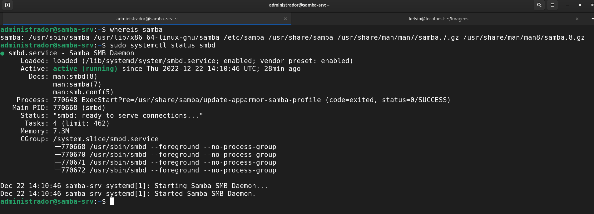


#### 2.3) Backup do arquivo de configuração do Samba e criação de um novo arquivos com os comandos necessários.

```
$ sudo cp /etc/samba/smb.conf{,.backup}
$ ls -la
$ sudo bash -c 'grep -v -E "^#|^;" /etc/samba/smb.conf.backup | grep . > /etc/samba/smb.conf'
$ sudo nano /etc/samba/smb.conf
```


falta imagens.

#### 2.4) Editando o arquivo de configuração /etc/samba/smb.conf

```
$ sudo nano /etc/samba/smb.conf
$ sudo systemctl restart smbd
$ sudo systemctl restart smbd
$ cat /etc/samba/smb.conf
```
Linha de interfaces alterada para "10.9.13.1/24 ens160 ens192 enp0s3"


* Logo em seguida deve-se criar um usuário do S.O para utilizar o compartilhamento Samba.

```
* usuário: aluno
* senha: alunoifal
```
```
$ sudo adduser aluno
```
* Vinculando o usuário do S.O ao Serviço Samba para acessar o compartilhamento de arquivo. Neste caso repetiremos a senha do usuário aluno.

```
$ sudo smbpasswd -a aluno
New SMB password:
Retype new SMB password:
Added user aluno.
$ sudo usermod -aG sambashare aluno
```


* Agora que o Samba já encontra-se instalado basta criar um diretório para que possamos compartilhá-lo em rede.


```
$ mkdir /home/<username>/sambashare/
$ sudo mkdir -p /samba/public
```


* Em seguida devemos configurar as permissões para que qualquer um possa acessar o compartilhamento público.

```
sudo chown -R nobody:nogroup /samba/public
sudo chmod -R 0775 /samba/public
sudo chgrp sambashare /samba/public

```

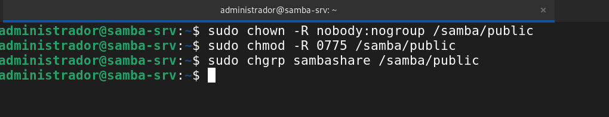

#### 2.5) Cliente de compartilhamento

* Para o último passo basta em uma máquina digite no Winndows Explorer o endereço IP do servidor samba da seguinte forma:
**\\ip_do_maquina**. Exemplo: \\10.9.13.119

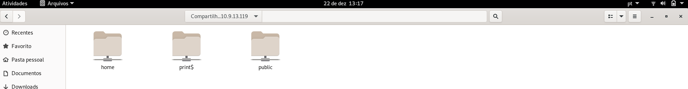
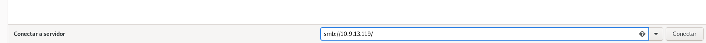

* Vídeo realizando a conexão e acessando o arquivo de texto criado anteriormente

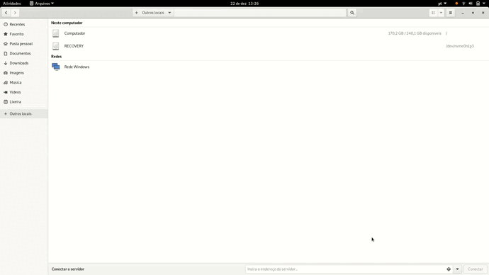

### **3) Instalação e configuração do NS1 (DNS MASTER)**

O Bind9 ou Berkeley Internet Name Domain é um servidor utilizado para o protocólo DNS, na qual tem a serventia de garantir uma maior agilidade na navegação visto que permite que o usuário apenas lembre do hostname de um site ao invés de seu endereço IP, portanto é o Bind9 que irá permitir o uso deste protocolo no Ubuntu.

#### 3.1) Instalando o Bind9

```
sudo apt-get install bind9 dnsutils bind9-doc 
```

<p><center> Figura X:  Instalando o Bind9.</center></p>   


#### 3.2) Verificando o status do serviço Bind9

```
sudo systemctl status bind9 
```

<p><center> Figura X:  Verificando o status do serviço.</center></p>   


#### 3.3) Verificando os diretórios do Bind

```
ls /etc/bind
```

<p><center> Figura X:  Verificando os diretórios do Bind.</center></p>   


#### 3.4) Criando um diretório para as "zones"

Criando um diretório para armazenar os arquivos das zonas.

```
sudo mkdir /etc/bind/zones
```

<p><center> Figura X:  Criando um diretório para zonas.</center></p>   


#### 3.5) Copiando Banco de Dados para o nosso domínio (Zona Direta) 

Fazendo uma cópia do arquivo db.empty para o db.grupo1.turma913.ifalara.local, isso na Zona Direta

```
sudo cp /etc/bind/db.empty /etc/bind/zones/db.grupo1.turma913.ifalara.local
```

<p><center> Figura X:  Copiando Banco de Dados (Zona Direta).</center></p>   


#### 3.6) Copiando Banco de Dados para o nosso domínio (Zona Reversa)

Utilizado para quando não se conhece o endereço IP, mas sabe-se o nome do host.
Para isso, faz-se uma cópia do arquivo db.127 para o db.10.9.13.rev, isso na Zona Reversa.

```
sudo cp /etc/bind/db.127 /etc/bind/zones/db.10.9.13.rev
```

<p><center> Figura X:  Copiando Banco de Dados (Zona Reversa).</center></p>   
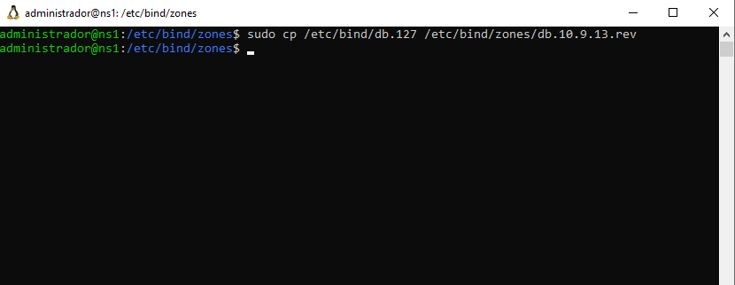

#### 3.7) Editando o Banco de Dados para o nosso domínio (Zona Direta)

```
sudo nano db.grupo1.turma913.ifalara.local 
```

Editar colocando as informações contidas na planilha.


```
;
; BIND data file for internal network
;
$ORIGIN grupo1.turma913.ifalara.local.
$TTL	3h
@	IN	SOA	ns1.grupo1.turma913.ifalara.local. root.grupo1.turma913.ifalara.local. (
	  	      2022122201	; Serial
			      3h	; Refresh
			      1h	; Retry
			      1w	; Expire
			      1h )	; Negative Cache TTL
;nameservers
@	IN	NS	ns1.grupo1.turma913.ifalara.local.
@	IN	NS	ns2.grupo1.turma913.ifalara.local.
;hosts
ns1.grupo1.turma913.ifalara.local.	  IN	A	10.9.13.121
ns2.grupo1.turma913.ifalara.local.	  IN	A	10.9.13.129
smb.grupo1.turma913.ifalara.local.	  IN	A	10.9.13.119
gw.grupo1.turma913.ifalara.local.	  IN 	A	10.9.13.107
www.grupo1.turma913.ifalara.local.	  IN 	A	10.9.13.211
db.grupo1.turma913.ifalara.local.	  IN 	A	10.9.13.212
```

<p><center> Figura X:  Editando Banco de Dados (Zona Direta).</center></p>   


#### 3.8) Editando o Banco de Dados para o nosso domínio (Zona Reversa)

```
sudo nano db.10.9.13.rev 
```

Editar colocando as informações contidas na planilha.


```
;
; BIND reverse data file of reverse zone for local area network 10.9.13.0/24
;
$TTL    604800
@       IN      SOA     grupo1.turma913.ifalara.local. root.grupo1.turma913.ifalara.local. (
                     2022122200         ; Serial
                         604800         ; Refresh
                          86400         ; Retry
                        2419200         ; Expire
                         604800 )       ; Negative Cache TTL

; name servers
@      IN      NS      ns1.grupo1.turma913.ifalara.local.
@      IN      NS      ns2.grupo1.turma913.ifalara.local.

; PTR Records
121   IN      PTR     ns1.grupo1.turma913.ifalara.local.              ; 10.9.13.121
129   IN      PTR     ns2.grupo1.turma913.ifalara.local.              ; 10.9.13.129
119   IN      PTR     smb.grupo1.turma913.ifalara.local.    	      ; 10.9.13.119
107   IN      PTR     gw.grupo1.turma913.ifalara.local.               ; 10.9.13.107
211   IN      PTR     www.grupo1.turma913.ifalara.local.              ; 10.9.13.211
212   IN      PTR     bd.grupo1.turma913.ifalara.local.               ; 10.9.13.212
```

<p><center> Figura X:  Editando Banco de Dados (Zona Reversa).</center></p>   
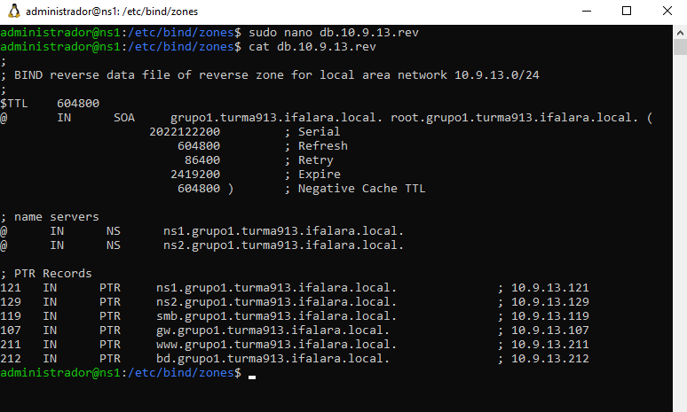

#### 3.9) Ativando os arquivos das zonas

```
sudo nano /etc/bind/named.conf.local
```

Inserir as informações de acordo com os arquvios db


```
//
// Do any local configuration here
//

// Consider adding the 1918 zones here, if they are not used in your
// organization
//include "/etc/bind/zones.rfc1918";

zone "grupo1.turma913.ifalara.local" {
	type master;
	file "/etc/bind/zones/db.grupo1.turma913.ifalara.local";
	allow-transfer{ 10.9.13.11; };  
	allow-query{any;};
};

zone "13.9.10.in-addr.arpa" IN {
	type master;
	file "/etc/bind/zones/db.10.9.13.rev";
	allow-transfer{ 10.9.13.11; };
};
```

<p><center> Figura X:  Ativando os arquivos das zonas.</center></p>   
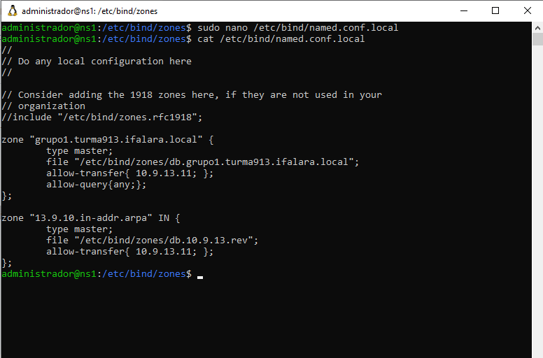

#### 3.10) Checando a sintaxe do arquivo de ativação

```
sudo named-checkconf
```

<p><center> Figura X:  Checando a sintaxe do arquivo de ativação. </center></p>   
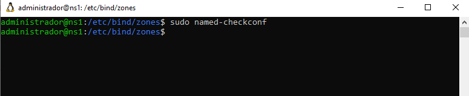

#### 3.11) Checando a sintaxe dos arquivo de dados

Antes deve-se entrar no diretório das zonas

```
cd /etc/bind/zones
```
Logo após digitar o comando:

```
sudo named-checkzone grupo1.turma913.ifalara.local db.grupo1.turma913.ifalara.local
```

Caso o resultado retornado seja: 

```
zone labredes.ifalarapiraca.local/IN: loaded serial 1
OK
```

Esta tudo funcionando perfeitamente, o mesmo vale para o arquivo seguinte.

```
sudo named-checkzone 13.9.10.in-addr.arpa db.10.9.13.rev
```
Retorno:

```
zone 14.9.10.in-addr.arpa/IN: loaded serial 1
OK
```

<p><center> Figura X:  Checando a sintaxe dos arquivo de dados 1. </center></p>   
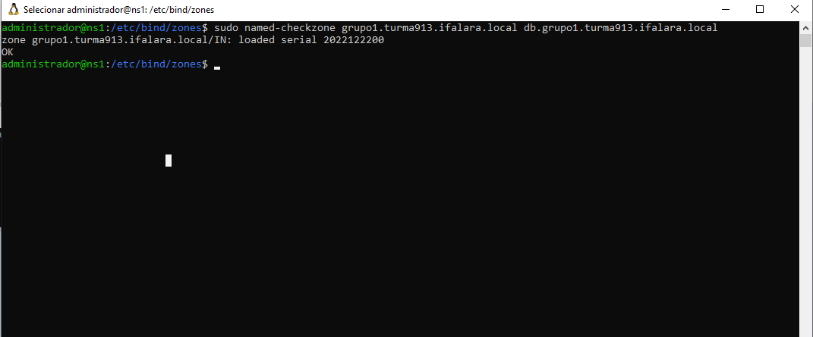

<p><center> Figura X:  Checando a sintaxe dos arquivo de dados 2. </center></p>   


#### 3.12) Configuração para resolver apenas endereço IPv4

```
sudo nano /etc/default/named
```
Editando ou adicionando apenas ```OPTIONS="-4 -u bind"``` a última linha.
Ficando dessa forma:

```
# run resolvconf?
RESOLVCONF=no

# startup options for the server
OPTIONS="-4 -u bind"
```

<p><center> Figura X:  Configuração para IPv4.</center></p>   
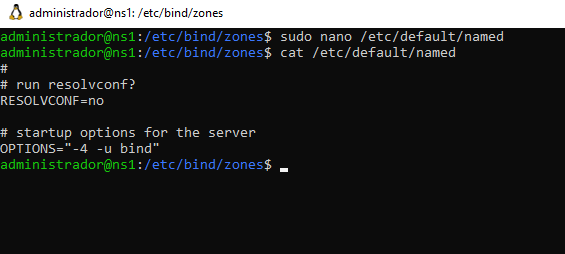

#### 3.13) Restartando ou Iniciando o Bind9

Utilizando o comando ```sudo systemctl restart bind9``` para restartar.
E ```sudo systemctl enable bind9``` caso seja necessáro.


<p><center> Figura X:  Restartando ou Iniciando o Bind9.</center></p>   


#### 3.14) Configuração para os clientes

Para isso, deve-se editar o arquivo:

```
sudo vi /etc/netplan/00-installer-config.yaml
```

Basta adicionar algumas informações para a configuração dos clientes.
Entre elas, alterar o os endereços ns1 e ns2 e o domínio para aqueles definidos na planilha.

```
# This is the network config written by 'subiquity'
network:
  renderer: networkd
  ethernets:
    ens160:
      dhcp4: false
      addresses: [10.9.13.121/24]
      gateway4: 10.9.13.1 
      nameservers:
         addresses:
           - 10.9.13.121 #ns1
           - 10.9.13.129 #ns2
         search: [grupo1.turma913.ifalara.local] #domínio                                                                                                                                
    ens192:
      dhcp4: false
      addresses: [192.168.13.11/28]
      #gateway4: 192.168.13.1 
      #nameservers:
         #addresses:
           #- 8.8.8.8 
           #- 8.8.4.4
         #search: []
  version: 2  
```


<p><center> Figura X:  Configuração para os clientes.</center></p>   
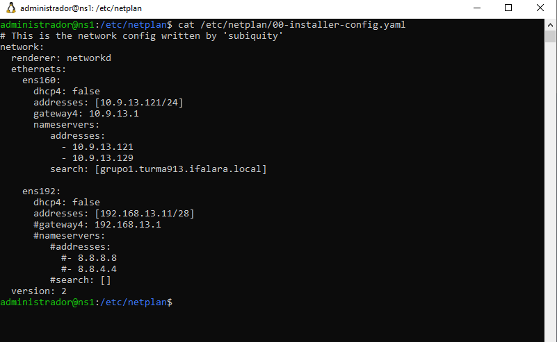

#### 3.15) Testes do Servidor

Primeiro iremos testar se os campos DNS servers e DNS Domain estão corretos, ou seja, se estão de acordo com a configuração do cliente que acabamos de editar.
Para isso, basta utilizar o comando:

```
resolvectl status ens160
```

No qual deve retornar os mesmo valores que inserimos no passo anterior, como pode ser observado na figura abaixo.

<p><center> Figura X:  Testando se os campos DNS servers e DNS Domain estão corretos.</center></p>   
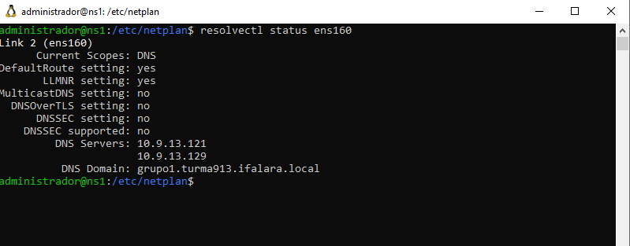


Após esse teste, iremos testar o serviço para a máquina ns1.
Para isso, basta utilizar o comando:

```
dig ns1.grupo1.turma913.ifalara.local
```

No qual deve retornar o resultado da pesquisa na linha ```ANSWER SECTION```, como pode ser visto na figura abaixo.

<p><center> Figura X:  Testando o servidor na máquina ns1.</center></p>   
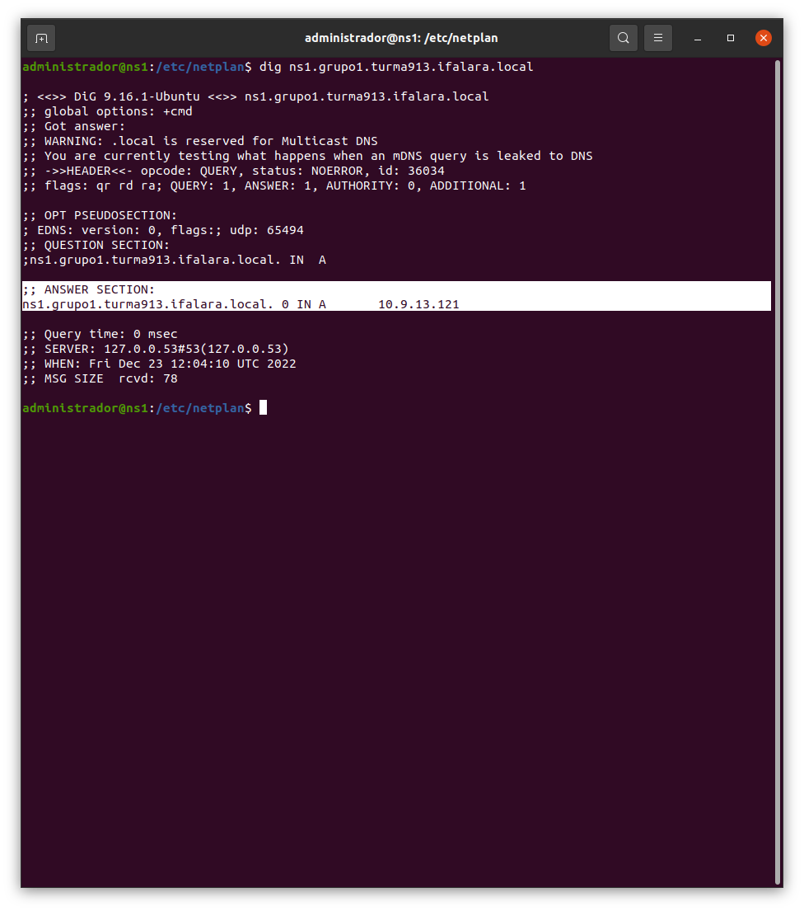

E por fim testar o serviço DNS Reverso.
Primeiramente na máquina com ns1, digitando o comando de acordo com o seu IP da planilha.

```
dig -x 10.9.13.121
```

Retornando este resultado da figura abaixo.

<p><center> Figura X:  Testando o DNS Reverso na máquina ns1.</center></p>   
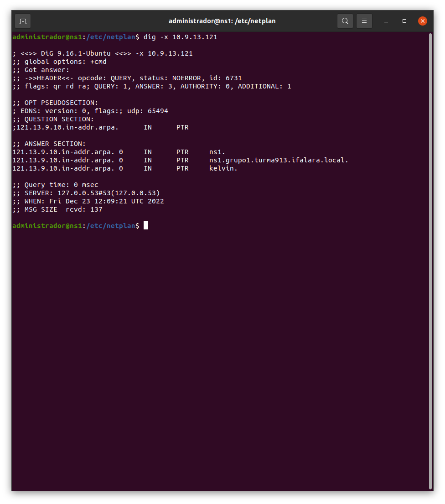

E após, fazer o mesmo para a máquina ns2.

```
dig -x 10.9.13.129
```
Como mostra na figura abaixo.

<p><center> Figura X:  Testando o DNS Reverso na máquina ns2.</center></p>   
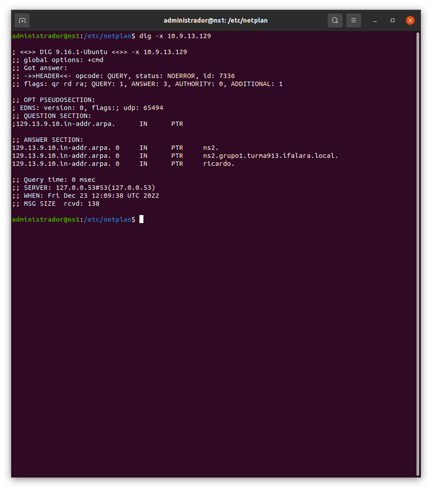


### **4) Instalação e configuração do NS2 (DSN SLAVE)**

#### 4.1) Alterando as configurações do Neplan

Para isso basta utilizar o comando: 

```
sudo nano /etc/netplan/00-instaler-config.yaml 
```

Inserindo as informações necessárias de acordo com a planilha.

```
network:
    ethernets:
        ens160:                        # interface local
            addresses: [10.9.13.129/24]  # ip/mascara
            gateway4: 10.9.13.1         # ip do gateway
            dhcp4: false               # 'false' para conf. estatica 
            nameservers:               # servidores dns
                addresses:
                - 10.9.13.121            # ip do ns1
                - 10.9.13.129            # ip do ns2
                search: [grupo1.turma913.ifalara.local]  # domínio
    version: 2
```

Após a edição deve-se salvar o arquivo e dar o comando ```sudo netplan apply``` para aplicar e ```ifconfig``` para verificar se funcionou.

<p><center> Figura X:  Configurando NETPLAN.</center></p>   
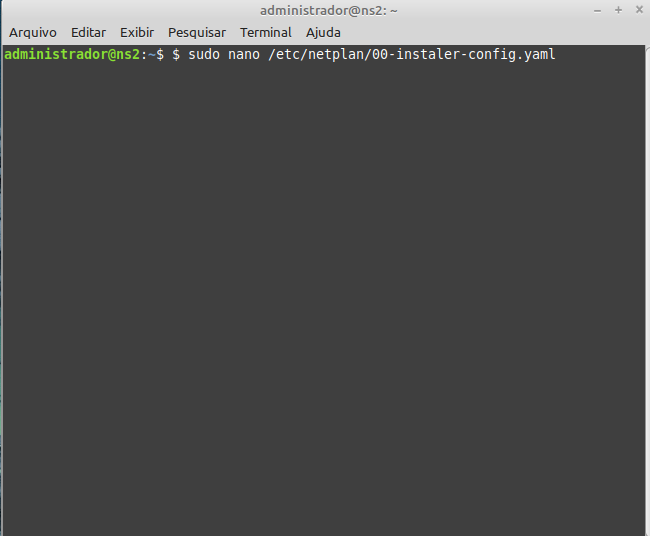

<p><center> Figura X:  Configurando NETPLAN.</center></p>   


<p><center> Figura X:  Configurando NETPLAN.</center></p>   


#### 4.2) Instalando o Bind9

Agora basta instalar o Bind9. Para isso basta utilizar o comando: 

```
sudo apt-get install bind9 dnsutils bind9-doc -y
```

<p><center> Figura X:  Instalando Bind9.</center></p>   
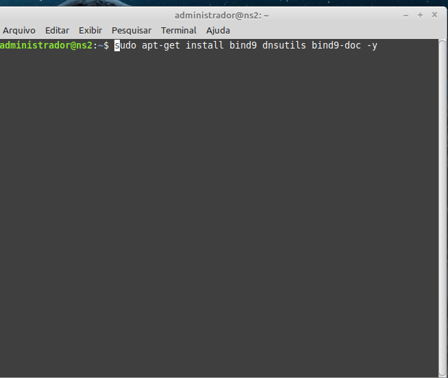

#### 4.3) Verificando o status do Bind9

Para isso basta utilizar o comando: 

```
sudo systemctl status bind9
```

E usar o comando ```sudo systemctl status bind9``` para ativar, caso não esteja ativado.

<p><center> Figura X:  Verificando status do Bind9.</center></p>   


#### 4.3) Verificando o status do Bind9

Para isso basta utilizar o comando: 

```
sudo systemctl status bind9
```

E usar o comando ```sudo systemctl status bind9``` para ativar, caso não esteja ativado.

<p><center> Figura X:  Verificando status do Bind9.</center></p>   


<p><center> Figura X:  Ativando o Bind9.</center></p>   


#### 4.4) Configurando as zonas

Para isso basta utilizar o comando ```sudo nano /etc/bind/named.conf.local``` e alterar de acordo com os arquivos necessários.

```
zone "grupo1.turma913.ifalara.local" {
  type slave;
  file "/etc/bind/zones/db.grupo1.turma913.ifalara.local";
  masters { 10.9.13.129; };
};

zone "13.9.10.in-addr.arpa" IN {
  type slave;
  file "/etc/bind/zones/db.10.9.13.rev";
  masters { 10.9.13.129; };
};
```

<p><center> Figura X:  Configurando Zonas.</center></p>   
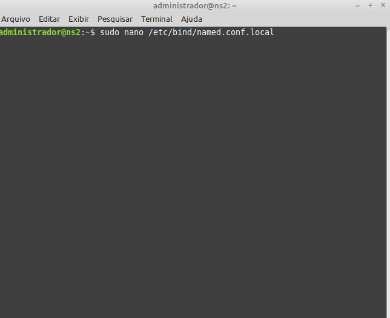

<p><center> Figura X:  Configurando Zonas.</center></p>   


#### 4.5) Checar a sintaxe da configuração
Para isso basta utilizar o comando: 

```
sudo named-checkconf
```

Caso não retorne nenhum erro, significa que está tudo funcionando corretamente.

<p><center> Figura X:  Checando sintaxe.</center></p>   


#### 4.6) Testes
Iremos usar o comando ```dig``` para fazer o teste. 
Para isso utilizaremos o comando:

```
dig @10.9.13.121 ns1.grupo1.turma913.ifalara.local
```

<p><center> Figura X:  Teste.</center></p>   
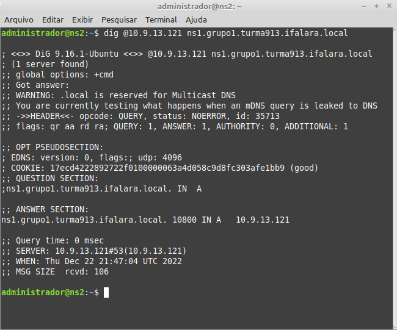

### **5) Instalação e configuração do Serviço WEB**

### **6) Instalação e configuração do BD**
