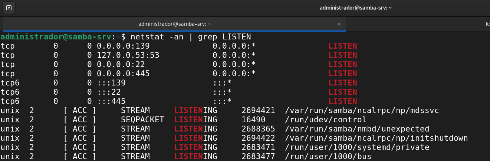

# Projeto Final - Infraestrutura e Serviços de Redes (Grupo-1)
Projeto final do Grupo 1 da disciplina de Infraestrutura e Serviços de Redes 

```
Instituto Federal de Alagoas - Campus Arapiraca
Professor: Alaelson Jatobá
Turma: 913
Aluno: Daniel Berg Silva Souza | Julio Cesár dos Santos Oliveira | Kelvin Holanda Leão Otilio | Ricardo Alexandre da Silva
```

### **1) Instalação e configuração do GW**

### **2) Instalação e configuração do Samba**


#### 2.1) Alterando nome da VM

```
$ sudo hostnamectl set-hostname samba-srv
$ reboot
```


Nome da VM Samba alterado para samba-srv.

#### 2.2) Instalando o servidor Samba na VM samba-srv

```
$ sudo apt update
$ sudo apt install samba
```

#### 2.2) Verificar se o Samba está rodando

```
$ whereis samba
$ sudo systemctl status smbd
$ netstat -an | grep LISTEN
```




#### 2.3) Backup do arquivo de configuração do Samba e criação de um novo arquivos com os comandos necessários.

```
$ sudo cp /etc/samba/smb.conf{,.backup}
$ ls -la
$ sudo bash -c 'grep -v -E "^#|^;" /etc/samba/smb.conf.backup | grep . > /etc/samba/smb.conf'
$ sudo nano /etc/samba/smb.conf
```


falta imagens.

#### 2.4) Editando o arquivo de configuração /etc/samba/smb.conf

```
$ sudo nano /etc/samba/smb.conf
$ sudo systemctl restart smbd
$ cat /etc/samba/smb.conf
```
Linha de interfaces alterada para "10.9.13.1/24 ens160 ens192 enp0s3"


### **3) Instalação e configuração do NS1 (DNS MASTER)**

O Bind9 ou Berkeley Internet Name Domain é um servidor utilizado para o protocólo DNS, na qual tem a serventia de garantir uma maior agilidade na navegação visto que permite que o usuário apenas lembre do hostname de um site ao invés de seu endereço IP, portanto é o Bind9 que irá permitir o uso deste protocolo no Ubuntu.

#### 3.1) Instalando o Bind9

```
sudo apt-get install bind9 dnsutils bind9-doc 
```

<p><center> Figura X:  Instalando o Bind9.</center></p>   


### **4) Instalação e configuração do NS2**

### **5) Instalação e configuração do Serviço WEB**

### **6) Instalação e configuração do BD**
