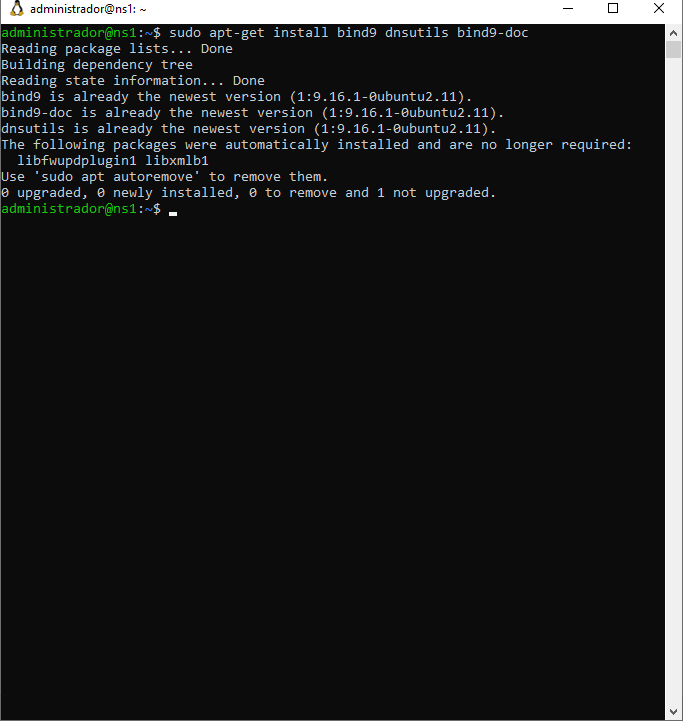

# Projeto Final - Infraestrutura e Serviços de Redes (Grupo-1)
Projeto final do Grupo 1 da disciplina de Infraestrutura e Serviços de Redes 

```
Instituto Federal de Alagoas - Campus Arapiraca
Professor: Alaelson Jatobá
Turma: 913
Aluno: Daniel Berg Silva Souza | Julio Cesár dos Santos Oliveira | Kelvin Holanda Leão Otilio | Ricardo Alexandre da Silva
```

### **1) Instalação e configuração do GW**

### **2) Instalação e configuração do Samba**

### **3) Instalação e configuração do NS1**

O Bind9 ou Berkeley Internet Name Domain é um servidor utilizado para o protocólo DNS, na qual tem a serventia de garantir uma maior agilidade na navegação visto que permite que o usuário apenas lembre do hostname de um site ao invés de seu endereço IP, portanto é o Bind9 que irá permitir o uso deste protocolo no Ubuntu.

#### 3.1) Instalação NS1 (DNS MASTER)

#### 3.1.1) Instalando o Bind9

```
sudo apt-get install bind9 dnsutils bind9-doc 
```

<p><center> Figura X:  Instalando o Bind9.</center></p>   


### **4) Instalação e configuração do NS2**

### **5) Instalação e configuração do Serviço WEB**

### **6) Instalação e configuração do BD**
