# **3) Instalação e configuração do NS1 (DNS MASTER)**

O Bind9 ou Berkeley Internet Name Domain é um servidor utilizado para o protocólo DNS, na qual tem a serventia de garantir uma maior agilidade na navegação visto que permite que o usuário apenas lembre do hostname de um site ao invés de seu endereço IP, portanto é o Bind9 que irá permitir o uso deste protocolo no Ubuntu.

## 3.1) Instalando o Bind9

```
sudo apt-get install bind9 dnsutils bind9-doc 
```

<p><center> Figura X:  Instalando o Bind9.</center></p>   
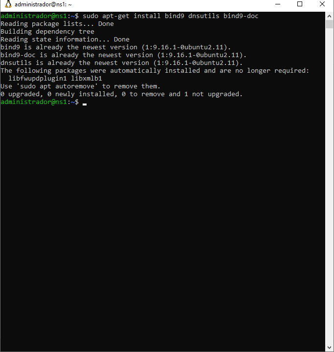

## 3.2) Verificando o status do serviço Bind9

```
sudo systemctl status bind9 
```

<p><center> Figura X:  Verificando o status do serviço.</center></p>   
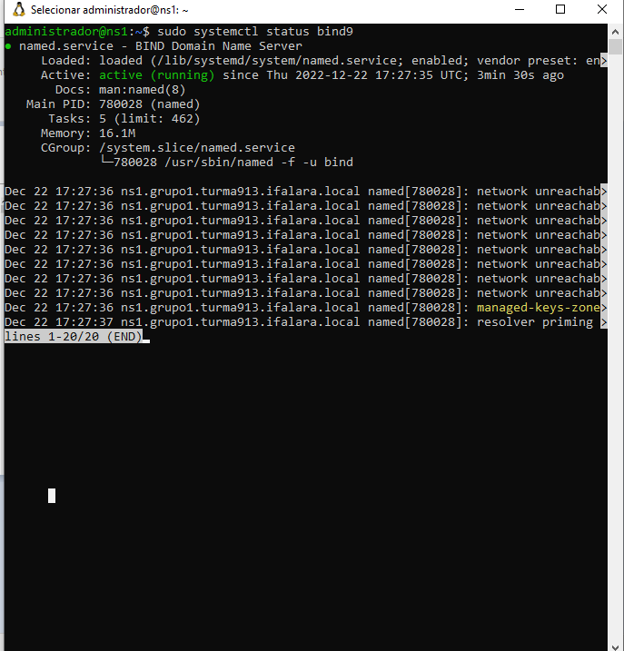

## 3.3) Verificando os diretórios do Bind

```
ls /etc/bind
```

<p><center> Figura X:  Verificando os diretórios do Bind.</center></p>   
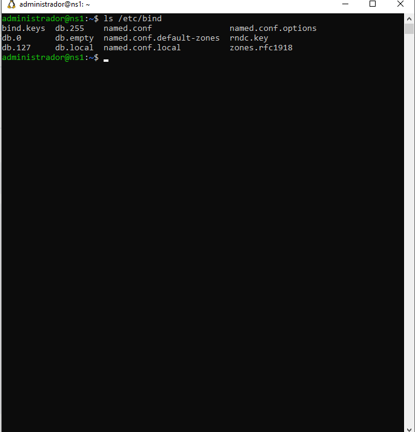

## 3.4) Criando um diretório para as "zones"

Criando um diretório para armazenar os arquivos das zonas.

```
sudo mkdir /etc/bind/zones
```

<p><center> Figura X:  Criando um diretório para zonas.</center></p>   
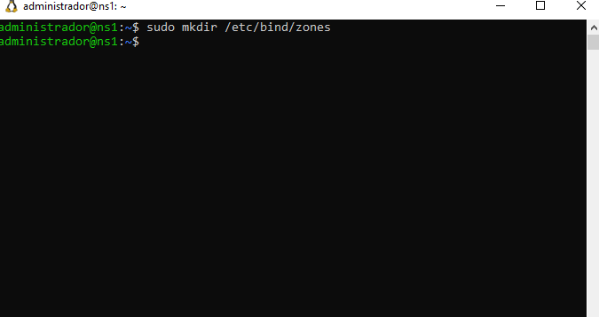

## 3.5) Copiando Banco de Dados para o nosso domínio (Zona Direta) 

Fazendo uma cópia do arquivo db.empty para o db.grupo1.turma913.ifalara.local, isso na Zona Direta

```
sudo cp /etc/bind/db.empty /etc/bind/zones/db.grupo1.turma913.ifalara.local
```

<p><center> Figura X:  Copiando Banco de Dados (Zona Direta).</center></p>   
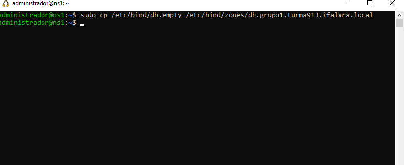

## 3.6) Copiando Banco de Dados para o nosso domínio (Zona Reversa)

Utilizado para quando não se conhece o endereço IP, mas sabe-se o nome do host.
Para isso, faz-se uma cópia do arquivo db.127 para o db.10.9.13.rev, isso na Zona Reversa.

```
sudo cp /etc/bind/db.127 /etc/bind/zones/db.10.9.13.rev
```

<p><center> Figura X:  Copiando Banco de Dados (Zona Reversa).</center></p>   
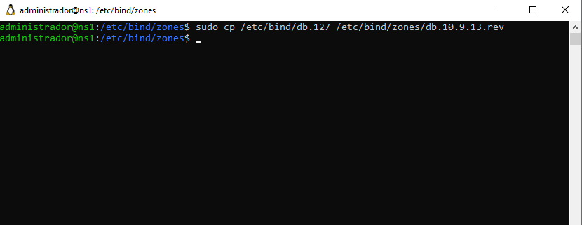

## 3.7) Editando o Banco de Dados para o nosso domínio (Zona Direta)

```
sudo nano db.grupo1.turma913.ifalara.local 
```

Editar colocando as informações contidas na planilha.


```
;
; BIND data file for internal network
;
$ORIGIN grupo1.turma913.ifalara.local.
$TTL	3h
@	IN	SOA	ns1.grupo1.turma913.ifalara.local. root.grupo1.turma913.ifalara.local. (
	  	      2022122201	; Serial
			      3h	; Refresh
			      1h	; Retry
			      1w	; Expire
			      1h )	; Negative Cache TTL
;nameservers
@	IN	NS	ns1.grupo1.turma913.ifalara.local.
@	IN	NS	ns2.grupo1.turma913.ifalara.local.
;hosts
ns1.grupo1.turma913.ifalara.local.	  IN	A	10.9.13.121
ns2.grupo1.turma913.ifalara.local.	  IN	A	10.9.13.129
smb.grupo1.turma913.ifalara.local.	  IN	A	10.9.13.119
gw.grupo1.turma913.ifalara.local.	  IN 	A	10.9.13.107
www.grupo1.turma913.ifalara.local.	  IN 	A	10.9.13.211
db.grupo1.turma913.ifalara.local.	  IN 	A	10.9.13.212
```

<p><center> Figura X:  Editando Banco de Dados (Zona Direta).</center></p>   
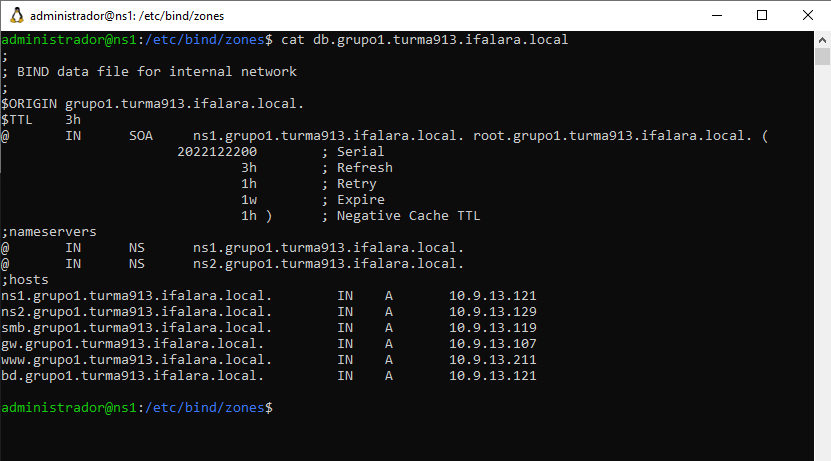

## 3.8) Editando o Banco de Dados para o nosso domínio (Zona Reversa)

```
sudo nano db.10.9.13.rev 
```

Editar colocando as informações contidas na planilha.


```
;
; BIND reverse data file of reverse zone for local area network 10.9.13.0/24
;
$TTL    604800
@       IN      SOA     grupo1.turma913.ifalara.local. root.grupo1.turma913.ifalara.local. (
                     2022122200         ; Serial
                         604800         ; Refresh
                          86400         ; Retry
                        2419200         ; Expire
                         604800 )       ; Negative Cache TTL

; name servers
@      IN      NS      ns1.grupo1.turma913.ifalara.local.
@      IN      NS      ns2.grupo1.turma913.ifalara.local.

; PTR Records
121   IN      PTR     ns1.grupo1.turma913.ifalara.local.              ; 10.9.13.121
129   IN      PTR     ns2.grupo1.turma913.ifalara.local.              ; 10.9.13.129
119   IN      PTR     smb.grupo1.turma913.ifalara.local.    	      ; 10.9.13.119
107   IN      PTR     gw.grupo1.turma913.ifalara.local.               ; 10.9.13.107
211   IN      PTR     www.grupo1.turma913.ifalara.local.              ; 10.9.13.211
212   IN      PTR     bd.grupo1.turma913.ifalara.local.               ; 10.9.13.212
```

<p><center> Figura X:  Editando Banco de Dados (Zona Reversa).</center></p>   
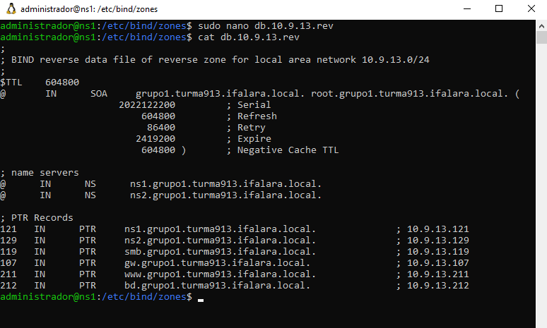

## 3.9) Ativando os arquivos das zonas

```
sudo nano /etc/bind/named.conf.local
```

Inserir as informações de acordo com os arquvios db


```
//
// Do any local configuration here
//

// Consider adding the 1918 zones here, if they are not used in your
// organization
//include "/etc/bind/zones.rfc1918";

zone "grupo1.turma913.ifalara.local" {
	type master;
	file "/etc/bind/zones/db.grupo1.turma913.ifalara.local";
	allow-transfer{ 10.9.13.11; };  
	allow-query{any;};
};

zone "13.9.10.in-addr.arpa" IN {
	type master;
	file "/etc/bind/zones/db.10.9.13.rev";
	allow-transfer{ 10.9.13.11; };
};
```

<p><center> Figura X:  Ativando os arquivos das zonas.</center></p>   
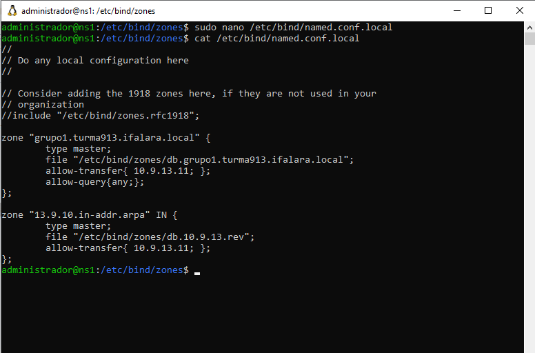

## 3.10) Checando a sintaxe do arquivo de ativação

```
sudo named-checkconf
```

<p><center> Figura X:  Checando a sintaxe do arquivo de ativação. </center></p>   
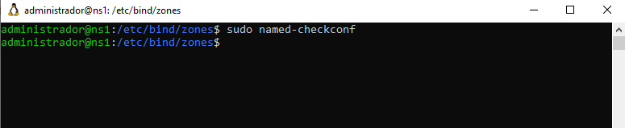

#### 3.11) Checando a sintaxe dos arquivo de dados

Antes deve-se entrar no diretório das zonas

```
cd /etc/bind/zones
```
Logo após digitar o comando:

```
sudo named-checkzone grupo1.turma913.ifalara.local db.grupo1.turma913.ifalara.local
```

Caso o resultado retornado seja: 

```
zone labredes.ifalarapiraca.local/IN: loaded serial 1
OK
```

Esta tudo funcionando perfeitamente, o mesmo vale para o arquivo seguinte.

```
sudo named-checkzone 13.9.10.in-addr.arpa db.10.9.13.rev
```
Retorno:

```
zone 14.9.10.in-addr.arpa/IN: loaded serial 1
OK
```

<p><center> Figura X:  Checando a sintaxe dos arquivo de dados 1. </center></p>   


<p><center> Figura X:  Checando a sintaxe dos arquivo de dados 2. </center></p>   


## 3.12) Configuração para resolver apenas endereço IPv4

```
sudo nano /etc/default/named
```
Editando ou adicionando apenas ```OPTIONS="-4 -u bind"``` a última linha.
Ficando dessa forma:

```
# run resolvconf?
RESOLVCONF=no

# startup options for the server
OPTIONS="-4 -u bind"
```

<p><center> Figura X:  Configuração para IPv4.</center></p>   
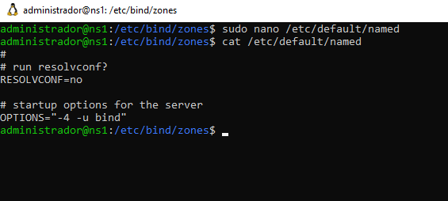

#### 3.13) Restartando ou Iniciando o Bind9

Utilizando o comando ```sudo systemctl restart bind9``` para restartar.
E ```sudo systemctl enable bind9``` caso seja necessáro.


<p><center> Figura X:  Restartando ou Iniciando o Bind9.</center></p>   
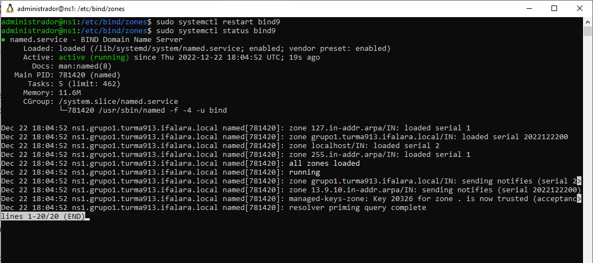

## 3.14) Configuração para os clientes

Para isso, deve-se editar o arquivo:

```
sudo vi /etc/netplan/00-installer-config.yaml
```

Basta adicionar algumas informações para a configuração dos clientes.
Entre elas, alterar o os endereços ns1 e ns2 e o domínio para aqueles definidos na planilha.

```
# This is the network config written by 'subiquity'
network:
  renderer: networkd
  ethernets:
    ens160:
      dhcp4: false
      addresses: [10.9.13.121/24]
      gateway4: 10.9.13.1 
      nameservers:
         addresses:
           - 10.9.13.121 #ns1
           - 10.9.13.129 #ns2
         search: [grupo1.turma913.ifalara.local] #domínio                                                                                                                                
    ens192:
      dhcp4: false
      addresses: [192.168.13.11/28]
      #gateway4: 192.168.13.1 
      #nameservers:
         #addresses:
           #- 8.8.8.8 
           #- 8.8.4.4
         #search: []
  version: 2  
```


<p><center> Figura X:  Configuração para os clientes.</center></p>   
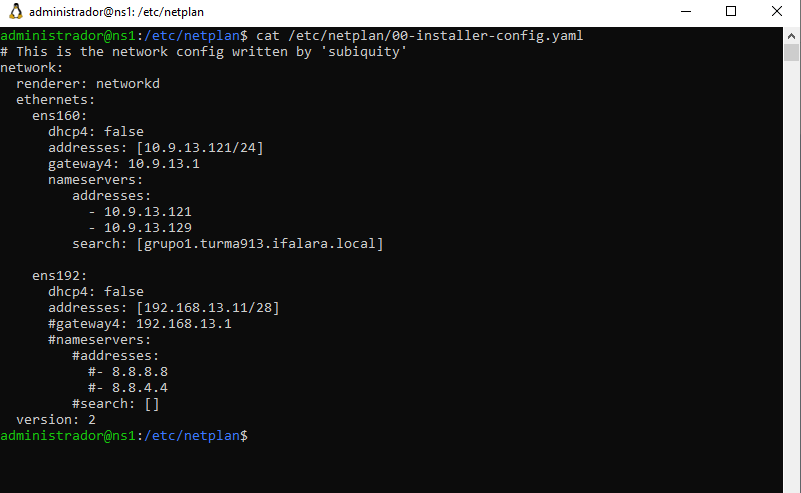

## 3.15) Testes do Servidor

Primeiro iremos testar se os campos DNS servers e DNS Domain estão corretos, ou seja, se estão de acordo com a configuração do cliente que acabamos de editar.
Para isso, basta utilizar o comando:

```
resolvectl status ens160
```

No qual deve retornar os mesmo valores que inserimos no passo anterior, como pode ser observado na figura abaixo.

<p><center> Figura X:  Testando se os campos DNS servers e DNS Domain estão corretos.</center></p>   
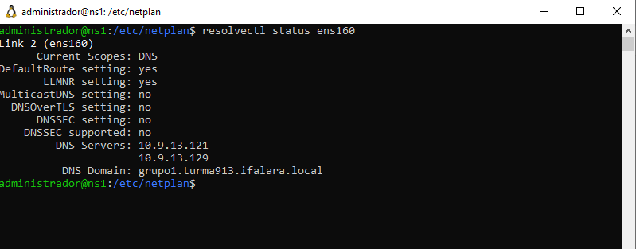


Após esse teste, iremos testar o serviço para a máquina ns1.
Para isso, basta utilizar o comando:

```
dig ns1.grupo1.turma913.ifalara.local
```

No qual deve retornar o resultado da pesquisa na linha ```ANSWER SECTION```, como pode ser visto na figura abaixo.

<p><center> Figura X:  Testando o servidor na máquina ns1.</center></p>   
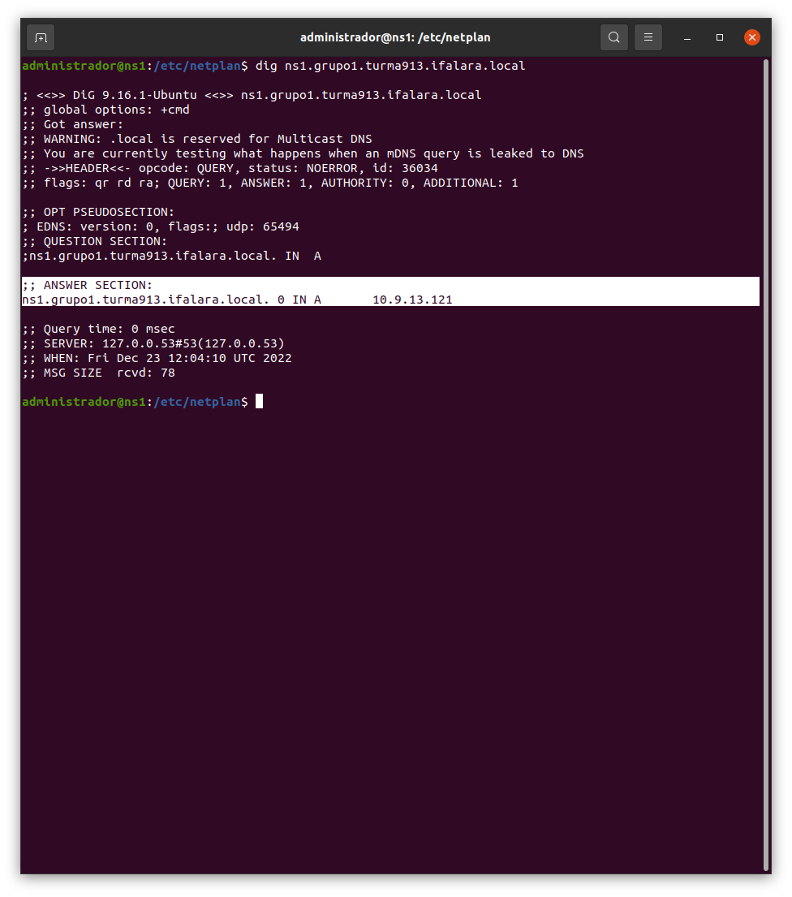

E por fim testar o serviço DNS Reverso.
Primeiramente na máquina com ns1, digitando o comando de acordo com o seu IP da planilha.

```
dig -x 10.9.13.121
```

Retornando este resultado da figura abaixo.

<p><center> Figura X:  Testando o DNS Reverso na máquina ns1.</center></p>   
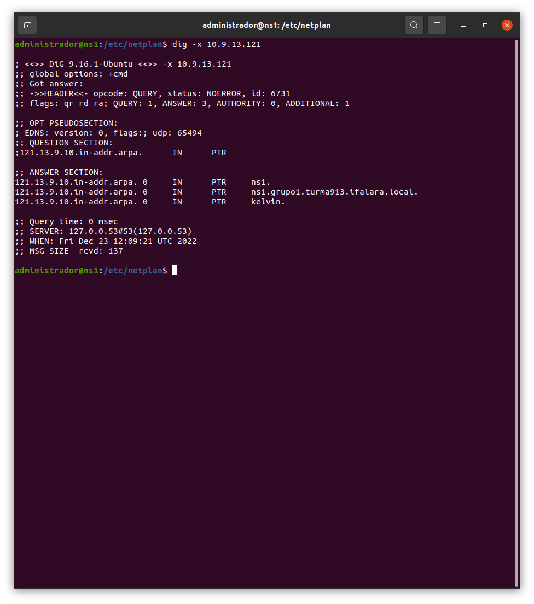

E após, fazer o mesmo para a máquina ns2.

```
dig -x 10.9.13.129
```
Como mostra na figura abaixo.

<p><center> Figura X:  Testando o DNS Reverso na máquina ns2.</center></p>   
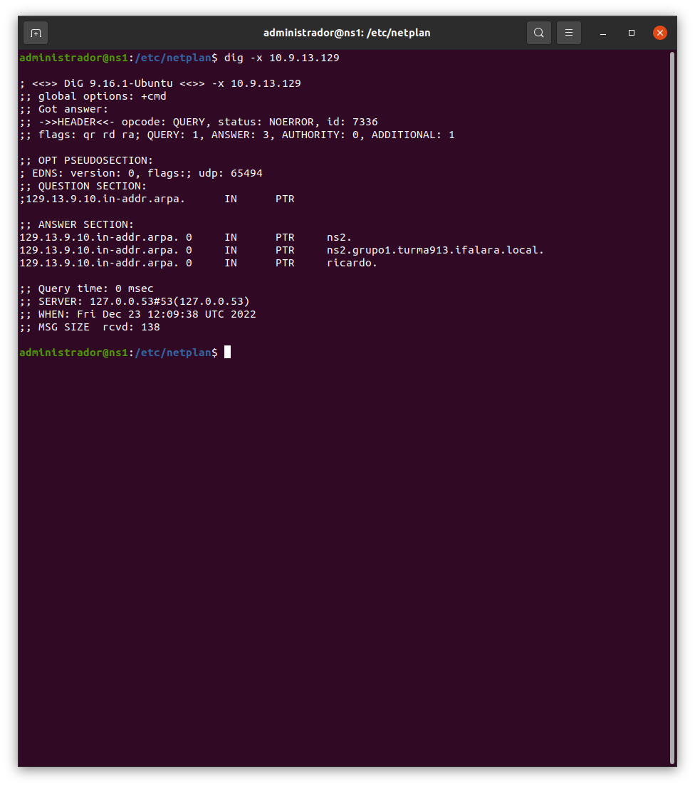

