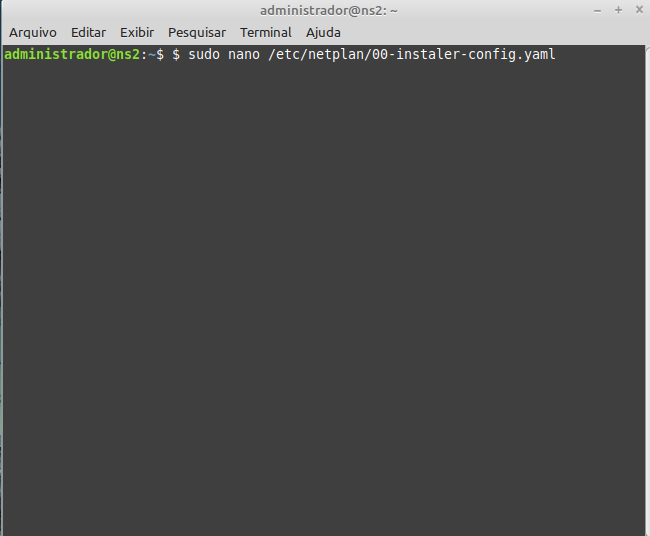
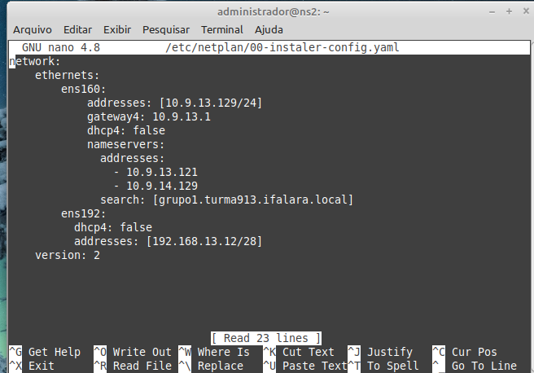
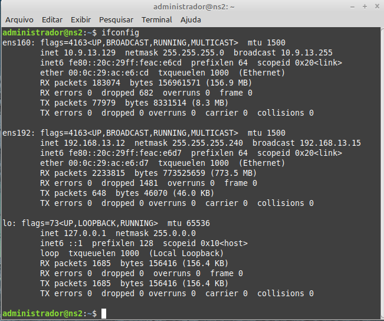
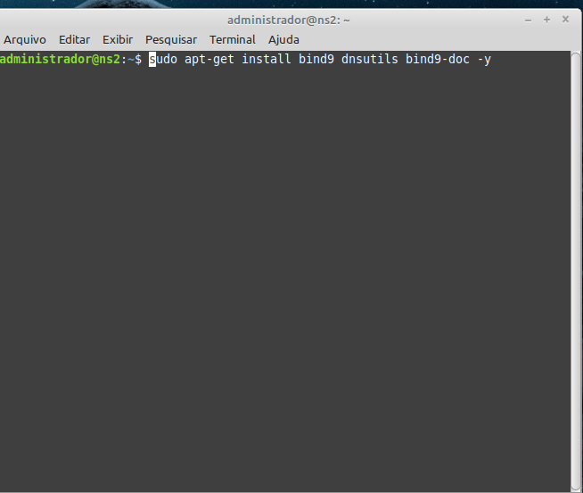
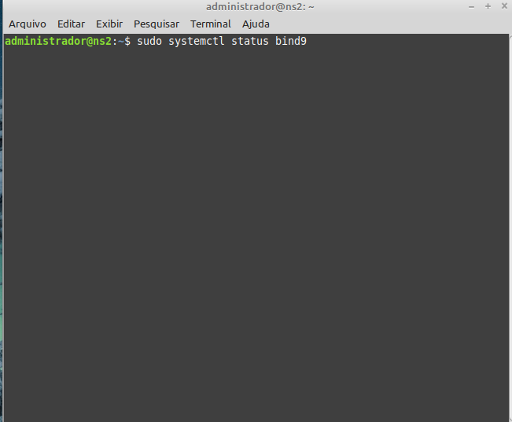
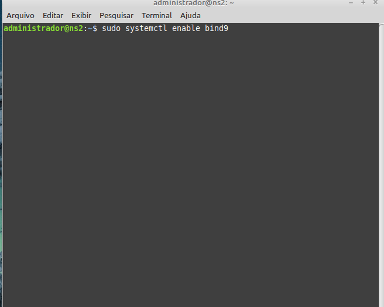
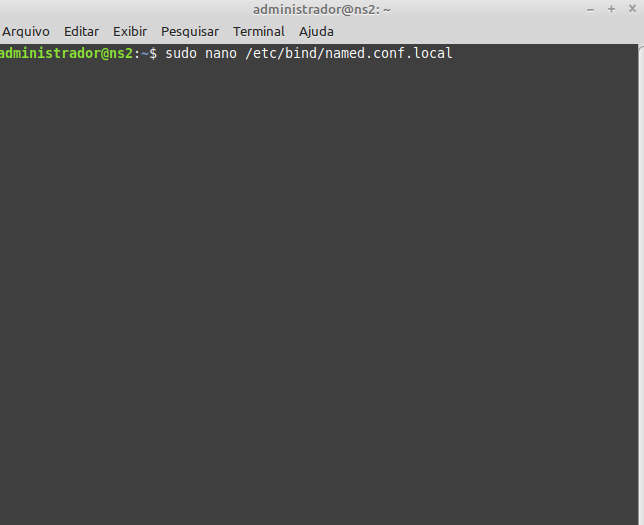
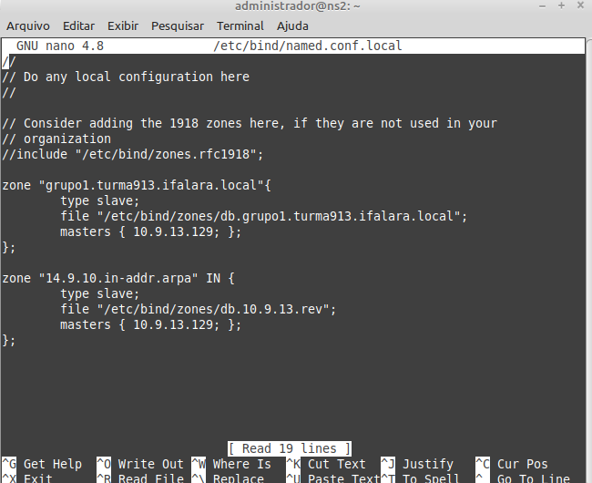
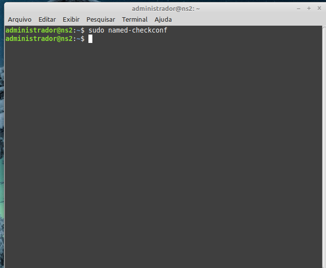
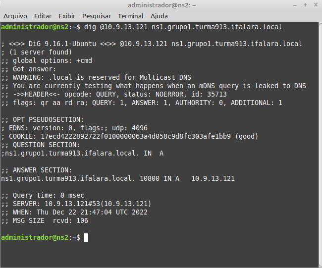

# **4) Instalação e configuração do NS2 (DSN SLAVE)**

## 4.1) Alterando as configurações do Neplan

Para isso basta utilizar o comando: 

```
sudo nano /etc/netplan/00-instaler-config.yaml 
```

Inserindo as informações necessárias de acordo com a planilha.

```
network:
    ethernets:
        ens160:                        # interface local
            addresses: [10.9.13.129/24]  # ip/mascara
            gateway4: 10.9.13.1         # ip do gateway
            dhcp4: false               # 'false' para conf. estatica 
            nameservers:               # servidores dns
                addresses:
                - 10.9.13.121            # ip do ns1
                - 10.9.13.129            # ip do ns2
                search: [grupo1.turma913.ifalara.local]  # domínio
    version: 2
```

Após a edição deve-se salvar o arquivo e dar o comando ```sudo netplan apply``` para aplicar e ```ifconfig``` para verificar se funcionou.

<p><center> Figura X:  Configurando NETPLAN.</center></p>   


<p><center> Figura X:  Configurando NETPLAN.</center></p>   


<p><center> Figura X:  Configurando NETPLAN.</center></p>   



#### 4.2) Instalando o Bind9

Agora basta instalar o Bind9. Para isso basta utilizar o comando: 

```
sudo apt-get install bind9 dnsutils bind9-doc -y
```

<p><center> Figura X:  Instalando Bind9.</center></p>   


## 4.3) Verificando o status do Bind9

Para isso basta utilizar o comando: 

```
sudo systemctl status bind9
```

E usar o comando ```sudo systemctl status bind9``` para ativar, caso não esteja ativado.

<p><center> Figura X:  Verificando status do Bind9.</center></p>   


## 4.3) Verificando o status do Bind9

Para isso basta utilizar o comando: 

```
sudo systemctl status bind9
```

E usar o comando ```sudo systemctl status bind9``` para ativar, caso não esteja ativado.

<p><center> Figura X:  Verificando status do Bind9.</center></p>   


<p><center> Figura X:  Ativando o Bind9.</center></p>   


## 4.4) Configurando as zonas

Para isso basta utilizar o comando ```sudo nano /etc/bind/named.conf.local``` e alterar de acordo com os arquivos necessários.

```
zone "grupo1.turma913.ifalara.local" {
  type slave;
  file "/etc/bind/zones/db.grupo1.turma913.ifalara.local";
  masters { 10.9.13.129; };
};

zone "13.9.10.in-addr.arpa" IN {
  type slave;
  file "/etc/bind/zones/db.10.9.13.rev";
  masters { 10.9.13.129; };
};
```

<p><center> Figura X:  Configurando Zonas.</center></p>   


<p><center> Figura X:  Configurando Zonas.</center></p>   


## 4.5) Checar a sintaxe da configuração
Para isso basta utilizar o comando: 

```
sudo named-checkconf
```

Caso não retorne nenhum erro, significa que está tudo funcionando corretamente.

<p><center> Figura X:  Checando sintaxe.</center></p>   


## 4.6) Testes
Iremos usar o comando ```dig``` para fazer o teste. 
Para isso utilizaremos o comando:

```
dig @10.9.13.121 ns1.grupo1.turma913.ifalara.local
```

No qual irá retornar a resposta:

<p><center> Figura X:  Teste.</center></p>   

