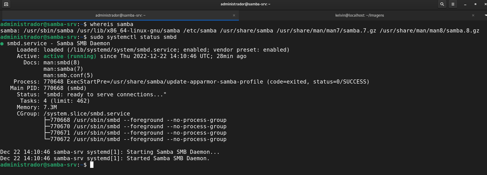
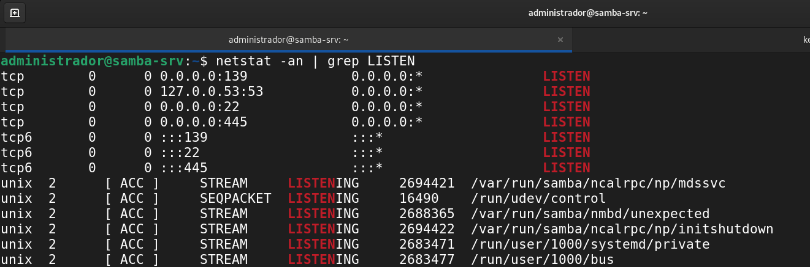
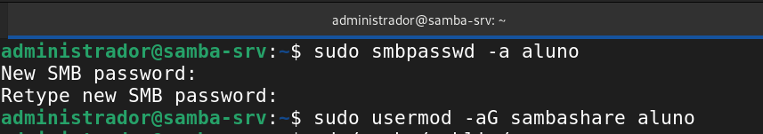
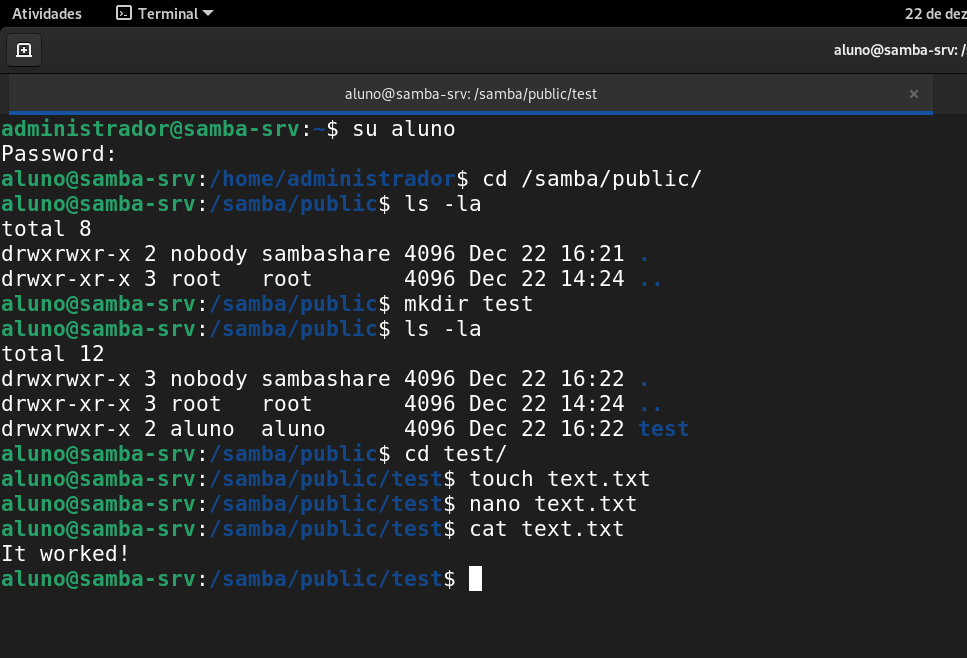
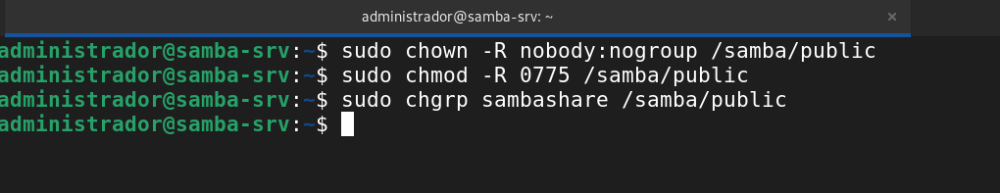
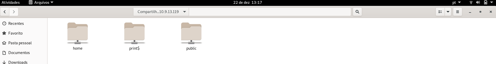
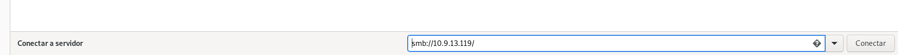
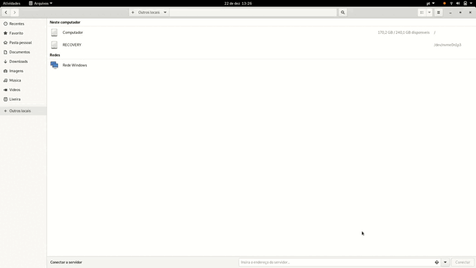

# **2) Instalação e configuração do Samba**


## 2.1) Alterando nome da VM

```
$ sudo hostnamectl set-hostname samba-srv
$ reboot
```


Nome da VM Samba alterado para samba-srv.

## 2.2) Instalando o servidor Samba na VM samba-srv

```
$ sudo apt update
$ sudo apt install samba
```

## 2.2) Verificar se o Samba está rodando

```
$ whereis samba
$ sudo systemctl status smbd
$ netstat -an | grep LISTEN
```




## 2.3) Backup do arquivo de configuração do Samba e criação de um novo arquivos com os comandos necessários.

```
$ sudo cp /etc/samba/smb.conf{,.backup}
$ ls -la
$ sudo bash -c 'grep -v -E "^#|^;" /etc/samba/smb.conf.backup | grep . > /etc/samba/smb.conf'
$ sudo nano /etc/samba/smb.conf
```


## 2.4) Editando o arquivo de configuração /etc/samba/smb.conf

```
$ sudo nano /etc/samba/smb.conf
$ sudo systemctl restart smbd
$ sudo systemctl restart smbd
$ cat /etc/samba/smb.conf
```
Linha de interfaces alterada para "127.0.0.1/8 ens160 ens192"


* Logo em seguida deve-se criar um usuário do S.O para utilizar o compartilhamento Samba.

```
* usuário: aluno
* senha: alunoifal
```
```
$ sudo adduser aluno
```
* Vinculando o usuário do S.O ao Serviço Samba para acessar o compartilhamento de arquivo. Neste caso repetiremos a senha do usuário aluno.

```
$ sudo smbpasswd -a aluno
New SMB password:
Retype new SMB password:
Added user aluno.
$ sudo usermod -aG sambashare aluno
```


* Agora que o Samba já encontra-se instalado basta criar um diretório para que possamos compartilhá-lo em rede.


```
$ mkdir /home/<username>/sambashare/
$ sudo mkdir -p /samba/public
```


* Em seguida devemos configurar as permissões para que qualquer um possa acessar o compartilhamento público.

```
sudo chown -R nobody:nogroup /samba/public
sudo chmod -R 0775 /samba/public
sudo chgrp sambashare /samba/public

```



## 2.5) Cliente de compartilhamento

* Para o último passo basta em uma máquina digite no Winndows Explorer o endereço IP do servidor samba da seguinte forma:
**\\ip_do_maquina**. Exemplo: \\10.9.13.119




* Vídeo realizando a conexão e acessando o arquivo de texto criado anteriormente


